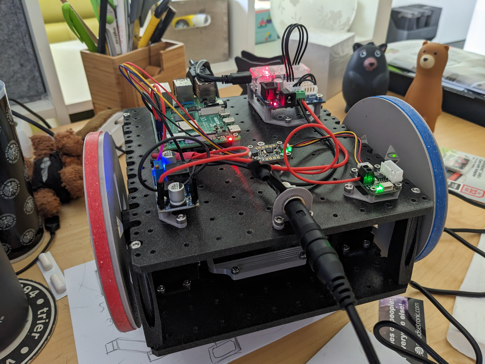

# Bungy Robot
The bungy_robot repository hosts a ROS2-based differential drive robot project designed for modularity and ease of use. Utilizing 3D-printed parts and powered by an array of sensors including an Adafruit BNO055 IMU, this robot can be remotely controlled through an Xbox controller.
The 3D printed part offer a lot of modularity with different platforms and a standardized grid to mount your electronics.
I used Dynamixel AX-12A servos as motors, the caster wheel is from a Roomba robot.

As the project is in a very early stage of development, not all the elements are already published. The 3D-printed parts will be published on [printables.com](https://www.printables.com) in the futur. Feel free to contact me if you have questions or you want to try bungy out in this early stage of development.




## Installation Instructions

Follow these steps to set up the robot workspace. The script will install ros_team_workspace and then setup a workspace for you:

```bash
wget https://raw.githubusercontent.com/CyberDNS/bungy_robot/main/install.sh
chmod +x install.sh
./install.sh
```

## Running Bungy

```bash
ros2 launch bungy_robot_description robot.launch.py
```

### Control by keyboard:
```bash
ros2 run teleop_twist_keyboard teleop_twist_keyboard --ros-args -r /cmd_vel:=/diff_cont/cmd_vel_unstamped
```

### Control by joystick or controller:
```bash
ros2 launch bungy_robot_description joystick.launch.py
```
