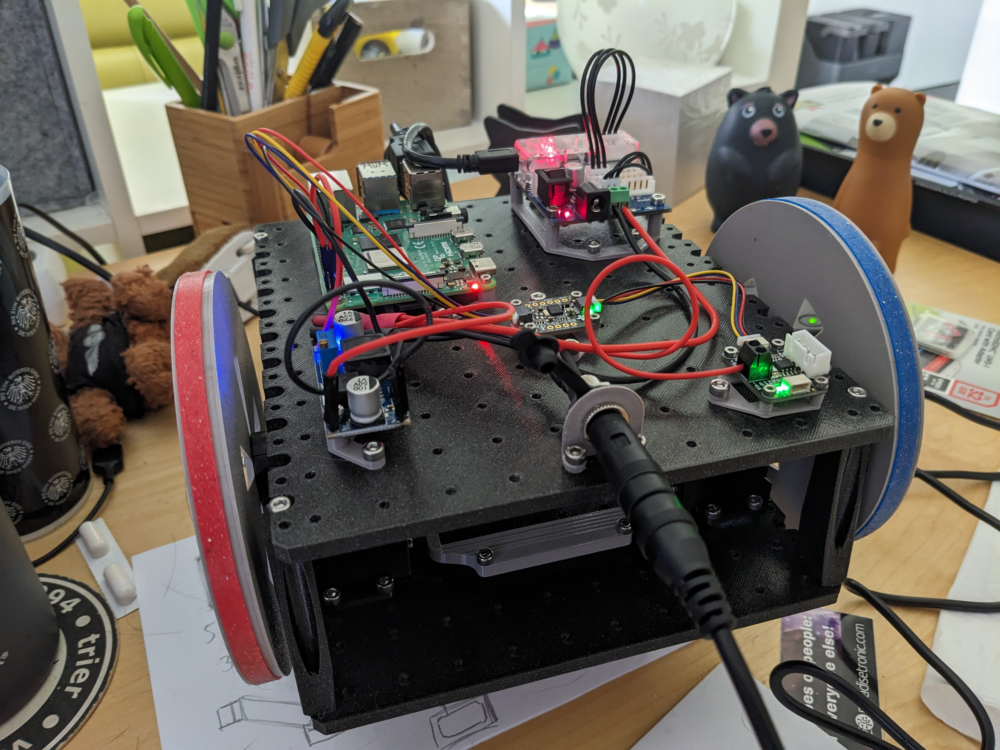

# Bungy Robot
The bungy_robot repository hosts a ROS2-based differential drive robot project designed for modularity and ease of use. Utilizing 3D-printed parts and powered by an array of sensors including an Adafruit BNO055 IMU, this robot can be remotely controlled through an Xbox controller.
The 3D printed part offer a lot of modularity with different platforms and a standardized grid to mount your electronics.
I used Dynamixel AX-12A servos as motors, the caster wheel is from a Roomba robot.

As the project is in a very early stage of development, not all the elements are already published. The 3D-printed parts will be published on [printables.com](https://www.printables.com) in the futur. Feel free to contact me if you have questions or you want to try bungy out in this early stage of development.



## Architecture Overview

The project uses a standardized multi-workspace architecture where all workspaces follow the same structure:

```
workspace_name/
├── src/                    # Source packages  
│   └── package_name/       # Individual ROS 2 packages
├── setup.bash             # Workspace setup script
├── build/                  # Build artifacts (generated)
├── install/                # Install artifacts (generated)
└── log/                    # Build logs (generated)
```

**Workspaces:**
- **`core_ws/src/bungy_description/`**: Shared robot description (URDF, meshes)
- **`robot_ws/src/bungy_bringup/`**: Robot hardware workspace (runs on Raspberry Pi 5)
- **`monitoring_ws/src/bungy_monitoring/`**: Visualization workspace (runs on NUC for monitoring)
- **`sim_ws/`**: Simulation workspace (future - will run on NUC)

## Quick Start

### 1. Build All Workspaces

```bash
# Clone the repository
git clone https://github.com/CyberDNS/bungy_robot.git
cd bungy_robot

# Build all workspaces (automatically handles dependencies)
./build.sh

# Or build specific workspaces
./build.sh core      # Build only core workspace
./build.sh robot     # Build only robot workspace  
./build.sh monitoring # Build only monitoring workspace
```

### 2. Running the Robot (Raspberry Pi 5)

```bash
cd robot_ws
source setup.bash

# Start robot with Xbox controller
ros2 launch bungy_bringup robot_with_joystick.launch.py

# OR start robot only (without joystick)
ros2 launch bungy_bringup robot.launch.py
```

### 3. Monitoring from NUC PC

```bash
cd monitoring_ws
source setup.bash

# Basic robot monitoring with RVIZ
ros2 launch bungy_monitoring monitor_robot.launch.py

# OR remote control + monitoring
ros2 launch bungy_monitoring remote_monitor.launch.py robot_ip:=192.168.1.100
```

## Network Configuration

### Multi-Machine Setup (Robot + NUC)

1. **Set the same ROS Domain ID** on both machines:
   ```bash
   export ROS_DOMAIN_ID=42
   ```

2. **Configure network communication**:
   ```bash
   export ROS_LOCALHOST_ONLY=0
   export CYCLONE_DDS_ENABLE_LOCALHOST_ONLY=false
   ```

3. **Verify connectivity**:
   - Both devices on same network
   - Test: `ping <robot_ip>`
   - Check topics: `ros2 topic list`

## Hardware Components

- **Raspberry Pi 5**: Main robot computer
- **Dynamixel AX-12A**: Differential drive servos with custom ros2_control interface
- **Slamtec RPLIDAR A1**: 2D 360° laser scanner
- **BNO055**: 9-DOF IMU sensor
- **INA219**: Current/power monitoring
- **WS2812**: RGB LED strips
- **Xbox One Controller**: Wireless teleoperation

## Control Flow

```
Xbox Controller → joy_node → teleop_twist_joy → /cmd_vel (Twist)
                                                     ↓
twist_to_stamped_relay.py → /bungy/diff_cont/cmd_vel (TwistStamped)
                                                     ↓
                           ros2_control → Dynamixel Hardware
```

## Build System

The enhanced build script provides flexible workspace management:

```bash
./build.sh              # Build all workspaces
./build.sh core         # Build only core_ws
./build.sh robot        # Build only robot_ws  
./build.sh monitoring   # Build only monitoring_ws
./build.sh clean        # Clean all workspaces
./build.sh core clean   # Clean only core_ws
./build.sh --help       # Show usage
```

## Monitoring Tools

The monitoring workspace provides comprehensive visualization:

- **RVIZ2**: Robot visualization with live joint states and TF frames
- **RQT Graph**: Node connections and topic visualization
- **RQT Plot**: Real-time data plotting
- **Teleop Keyboard**: Remote robot control via WASD keys

### Individual Tools

```bash
# Robot visualization
ros2 run rviz2 rviz2 -d $(ros2 pkg prefix bungy_monitoring)/share/bungy_monitoring/rviz/monitoring_view.rviz

# Topic monitoring
ros2 topic list
ros2 topic echo /bungy/joint_states
ros2 topic echo /cmd_vel

# Node graph visualization
ros2 run rqt_graph rqt_graph
```

## Troubleshooting

### No Robot Topics Visible
- Check network connectivity: `ping <robot_ip>`
- Verify ROS_DOMAIN_ID matches on both machines
- Ensure robot is running: `ros2 node list`

### RVIZ Shows No Robot Model
- Verify core_ws is built: `./build.sh core`
- Check robot_state_publisher: `ros2 node list | grep robot_state_publisher`
- Verify joint_states: `ros2 topic echo /bungy/joint_states`

### Network Discovery Issues
Add to `~/.bashrc` on both machines:
```bash
export ROS_DOMAIN_ID=42
export ROS_LOCALHOST_ONLY=0
export CYCLONE_DDS_ENABLE_LOCALHOST_ONLY=false
```

## Development

### Workspace Structure
```bash
# View standardized structure
./show_structure.sh

# Clean specific workspace when rebuilding
./build.sh robot clean
./build.sh robot
```

### Adding New Features
- **Sensors**: Add to `robot_ws/src/bungy_bringup/`
- **Visualization**: Add to `monitoring_ws/src/bungy_monitoring/`
- **Robot description**: Update `core_ws/src/bungy_description/`

## Future Roadmap

- **`sim_ws`**: Gazebo simulation using shared `bungy_description`
- **Navigation**: SLAM and path planning integration
- **Additional sensors**: Camera, additional LIDAR integration
- **Web interface**: Browser-based robot monitoring
